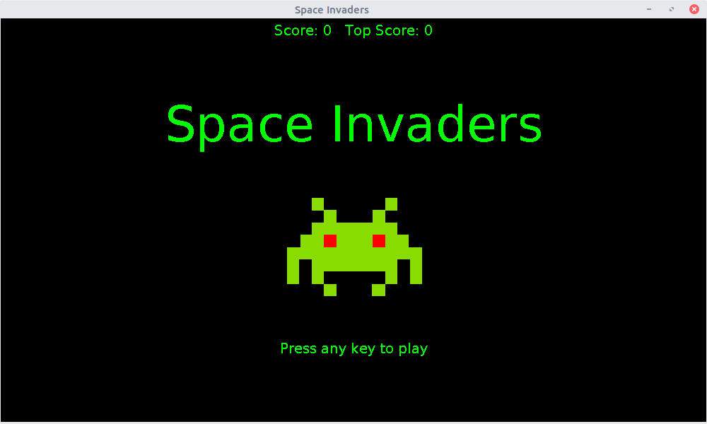
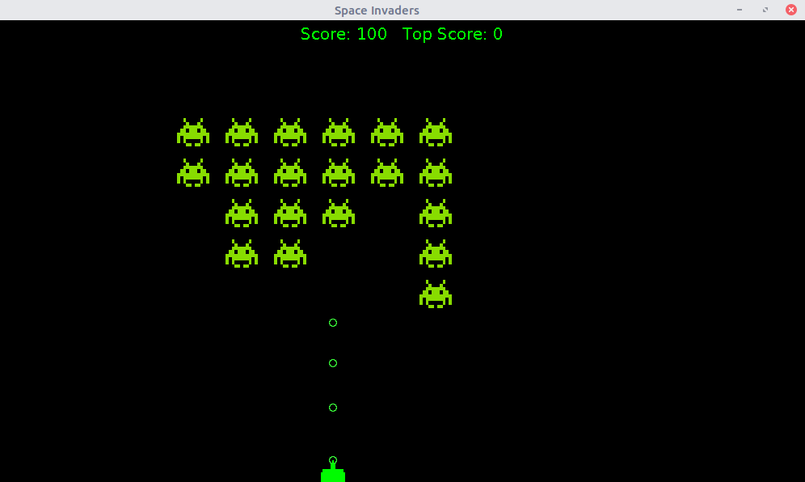

# SpaceInvaders
A version of the classic game 'Space Invaders' written in Java

## Getting Started

To build the project from the commandline, run:

```
javac -d build src/*.java
```

Then to run it, run:

```
java -cp build InvadersApplication
```

A window should open with the game ready to start - enjoy!

## Screenshots

Main menu:


Game in progress:

